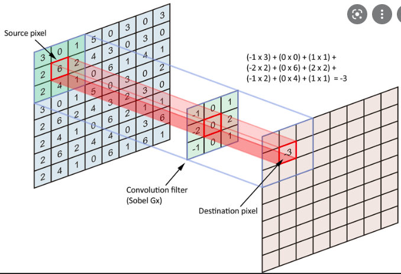

## PyTorch Notes:

- PyTorch is a deep learning library, it has many built in functions to the point where for the most part, the hard work is in designing the model itself. 
- This is a collection of notes that should help build some familiarity with PyTorch as well as provides some tips and tricks. 

### Importing PyTorch into Python:

- Import PyTorch with "import torch"

### Tensor Basics:

- Create a tensor with 0's/1's with the "empty/ones" methods, specifying the dimensions. 
- Create a random tensor with the "rand" method, again specifying the dimensions. 
- Use "tensor" to create your own custom tensor.
- Underscores after the method name can be used to do operations inplace. 
- Can splice just like we do with numpy arrays.
- .item() can be used to retrieve value from a scalar from a tesnor. 
- "view" method can be used to reshape tensors, specify dimensions. Note: useful to set one of the arguments to be -1 to say that we fill the array based on the other dimension. eg. a tensor is 2x2, then applying .view(4, -1) this tells PyTorch to convert to a 4x1.  
- Cast from tensor -> numpy array with .numpy(), note this method means that both objects share the same memory location. 
- Cast from numpy -> tensor with ".from_numpy()" method. 
- Often when creating tensors, can provide the keyword argument "requires_grad" to be "True". This tells PyTorch we will need the gradient wrt this tensor later. 
- "*" does element wise multiplication.  
- It's good practice to set the data type of a tensor. 

### Gradient Calculation: 

- The purpose of the "requires_grad" argument when creating a tensor is to compute derivates with respect to these variables. 
- Once we set requires_grad = True, whenever we apply an operation to this tensor, the operation will be tracked and the computation to get the derivative of the original tensors variables will be tracked. For example: if x is a tensor, then y=x+2, y is also a tensor. y will be stored with grad_fn = "AddBackward0" an arrow on the Dynamic Computation Graph. 
- The "backward" method can be called to compute intermediate derivates. Consider if z = y * y(element wise), y = x+2. Then z.backward() will compute dz/dy, then computes dy/dx, then applies Chain Rule. 
- These "steps" form a Dynamic Computation Graph which is stored when operations are written. 
- Graph nodes tend to be variables and arrows are mathematical operations. 
- Epochs are a way of defining the iteration of gradient descent we're on. 
- Use the context manager "with torch.no_grad()" to update the model params without adding to the computational graph. 
- After an update step of the model params in Gradient Descent, we should also call: ".grad_zero_()", this is because PyTorch accumulates gradients. 

### Training Pipeline:

- For training and designing a model, we can use the "nn" module from PyTorch: "import torch.nn as nn".
- This module contains a lot of the functions we would need: nn.MSELoss(), nn.optim.SGD([w], lr=learning_rate) for computing the loss and applying gradient descent. 
- The SGD function takes in the params that you'd expect: learning rate and the weights and we can call nn.optim.SGD([w], lr=learning_rate).step() to apply one iteration of Gradient descent.
- We can create instance of models using the "nn" module. eg. for a linear regression use: model = nn.Linear(input_size, output_size). This might seem confusing initially as since when does Linear Regression require input_size and output_size. Well if we consider Linear Regression in a neural network format, then this is essentially a single layered network where input_size = number of features and output_size = 1. (With g(x) = 1 as the activation function). 
- Once we've created a model/network then the method of "feeding forward" through our network is well defined. To feed forward using a model we just pass the design matrix/data points as an argumnet to model. eg: model(X_test).
- Note that when we create an instance of a model like above, the weights are randomly initialised as expected.
- The model params can be retrieved with "model.parameters()".

### Processing Data: 

#### Datasets and Dataloaders:

- Note an Epoch is the number of times the entire dataset will be parsed into the optimizer. 
- If we're dealing with big datasets, then we should parse out data into the optimizer in Batches. 
- This is where the "Datasets" and "Dataloaders" objects are useful. Dataset objects are given as arguments into Dataloaders. Dataloaders are used to used to wrap an iterable around the dataset, that way we can parse out data into batches to our optimizers. 
- To do this, we should create a class which inherits from the Dataset class. Define the __getitem__, __len__, __init__ methods. Note for the __getitem__ method, we should output a tuple with the datapoint and the target. 
- Parse this dataset object into the Dataloader so we can then loop through our data. Dataloaders take in some useful __keyword__ arguments: batch_size, shuffle, num_workers (number of cores used). 

#### Transforms:
- Typically our data will need some form of preprocessing before it's parsed into our model. 
- There are many built in transforms that we can use, a few examples are: rotations, grayscale, resize, casting tpyes. eg(numpy -> tensor)
- We can also use custom transforms: for modularity, we should do this processing in a "transform" class. 
- In our transform class we only need to define the "__call__" magic method containing what the transform should do to each datapoint. 
- Recall, we parse the Dataset object into the Dataloader, all we need to do is ammend the __getitem__ magic method in the Dataset clas so that the datapoint that is returned has been transformed. As we've defined the "__call__" method, this can be done with a call to the class. 
- Note: Parse the transformer instance as a keyword argument into the extended Dataset class, that way we can make use of the call functionality. 
- Don't forget, the call method needs to be passed a "sample" to transform. 
- The Compose object can take in a list of multiple transforms and return a new transform. Which we can use to apply multiple transforms in chronological order. 

### Softmax and Cross Entropy:
- The Softmax function is used to assign probabilities by normalising a vector.
- Given an n-dimensional vector of reals, it maps each by taking the exponent and dividing by the exponent of the sum of the values in the vector. 
- Given a k-class classification problem, we apply the Softmax function to the k-dimensional vector returned from the neural net to give a vector of probabilities where the ith value is the probability of belonging to the ith class. 
- The Cross Entropy function takes in 2 arguments: one is the the output vector of a neural net, the second is the actual class that the data point that was fed through the network corresponds to.
- The CE function applies the softmax function to an ouput of a Neural Net and computes the classification error as: -log(p_i) where p_i is the probability of the datapoint belonging to the class. This makes intuitive sense, if the probability is 1, then we get the error as 0, and the smaller p_i is, the progressively larger the error becomes. In other words if the probability of the datapoint actually belonging to the class is small (according to our model), then the error is large. 

### Activation Functions:
- Activation functions are applied between layers of a Neural Net, some activation functions have particular use cases which I'll outline below.
- Used in Binary Logistic regression to associate probability to classes. 
- TanH - Used in the hidden layers. Values between (-1,1). 
- ReLU = max(0,x), rule of thumb: use ReLU when we have no prior idea of the activation function. 
- Leaky ReLU is like ReLU for x>0, but for x<0, we return a*x where a is some gradient. This function is used to try solve the vanishing gradient problem: In particular recall the Backpropogation step requires the derivative of the activation function. A plot of the ReLU shows it has a 0 derivative for x<0, this means that the values at these nodes in our Neural net will never be updated. A good idea is if weights aren't updating through SGD, then this we can try the Leaky ReLU. 
- Softmax used for multiclass classifiction in the final layer. 
- These activation functions can be found in the "nn" module in PyTorch

### Convoluted Neural Networks: 
- CNNs (Convoluted Neural Networks) are quite similar to Nerual Networks however they differ because of the convolutional layer in the network which entail applying a convolution filter on some layers. 
- The typical architecture of a CNN will also involve a "pooling" layer. 
- So what is a convolution filter? 

- The graphic above shows how a convolution filter is applied to a matrix. 
- Essentially, the convolutional filter is a smaller dimension matrix which maps a matrix to a another matrix using the following process:
    1. Place the filter matrix "over" the original matrix in a "window" like manner. 
    2. Moving the convolution filter across the input matrix, will assign entries in the output matrix by taking an element wise sum. 
    3. For example, if we had a 3x3 input matrix, and a 2x2 convolution filter, the output matrix will be a 2x2. 
- Convolutional layers can be used to reduce the number of features throughout the layers of a neural network. 
- An example would be if we applied a CNN to images which are usually 3D tensors. An RGB picture is made of pixels of different colours,(consider a 5x5 picture), each pixel has a corresponding R(red), G(green), B(blue) value between 0 and 255 (totalling 75 nodes on the input layer). We can think of these 3 colour groups as 3 5x5 matrices. We can apply a different convolutional filter to each of these matrices, say a 3x3 matrix. Doing this will output 3 3x3 matrices, reducing the number of features from 75 to 27. 
- If dealing with a 3D tensor, we call the depth or the 3rd dimension a channel, so when we say "the output has 6 channels", this means 6 layers of depth. 
- The values in these convolution filters/kernels are are model parameters, ie their values are optimised in training. 
- Now we can answer what a "pooling" layer is in our Neural Network:

    1. A pooling layer is similar to a convolution filter in the sense that we used them to reduce the number of features between layers. 
    2. Say we have a 2D matrix of features, to applying a pooling layer, we "cover"/"partition" our 2D matrix into smaller mutually exclusive matrices. 
    3. Then we apply an operation on each of the sub-matrices, could max (Max Pooling), min (Min Pooling), avg (Average Pooling). 
    4. This will map each submatrices to a scalar. 
    5. Combine these scalars into a matrix to form the next layer in the Neural network. 
    6. Max Pooling Example: consider a 4x4 matrix, which can be divided into 4 2x2 matrices. If we take the max of each of the sub-matrices, and arrange them to make a matrix, we then end gone up with a 2x2 matrix. (16 features -> 4 features in the next layer.)
- Reducing the number of features, reduces the chances of our model being overfit.  
- The process of applying convolutional filters and pooling layers is called "Feature Learning" this is because typically in a Fully Connected Neural Network we assume the features are independent. (Otherwise coefficients can be grouped) In a picture, it's rare that the pixel intensities are independent. If we imagine a picture of the a purple flower, by knowing one pixel is purple, it's likely some of the surrounding pixels are also purple. This feature learning process tries to minimise the lack of indepdence by reducing features. 
- The fully connected layers in the network can be thought of as the "Classification" layer. 

### Transfer Learning: 
- Transfer learning is the process of adapting an already trained model for a new/similar use case. 
- For example if we had a model that classifies cars into brands, we could then adapt this model to classify cars into brands and colours. 
- Formally, a model that is already built for a first task, is used as the starting point for a second task. 
- Transfer learning typically changes the Fully Connected layers weights but the Feature Learning layers weights will be the same as the pre-trained model. 

### Tensorboard:
- Tensorboard is a visualisation toolkit for machine learning models we build.
- Some of the things we can do: 
    1. Tracking model metrics - loss and accuracy. 
    2. Viewing model architecture. 
    3. Displaying images/data. 
- Run "tensorboard logdir=runs" in terminal which will start tensorboard on the localhost. logdir is the path where the torch logs are stored. Defaulted to "runs". 
- Want to use "Summary Writer" from torchvision.utils. This object has a lot of the functionality we'd like: writer.add_graph(model, data) (used to visiualise net), writer.add_images('image names'), writer.add_scalar('graph title, 'scalar plotted') etc. This object needs to be closed once instantiated, a bit like a context manager - writer.close()
- Summary writer object takes in a path for where we store the logs for our model. This is good if we want to track multiple models on tensorboard. Just specify different directories when initialising the summary writers. 
- Can also generate precision/recall curves. This is a way of determining the threshold for assigning to a class. Note the threshold is typically for binary classification (yes/no), thus to extend to multi-class classification we binarize (if thats a word :D) the output. Hence for each class, we will have a precision recall curve. 

### Saving and Loading Models:
- Once a model has been trained, to use and deploy this model we need to save the model parameters. 
- The params of a model are stored in the "state_dict" method.
- For each layer in our network we typically have model params, with this layer-params correspondence, we can store the params in a dictionary. 
- There are 3 main methods that we will use: torch.save, torch.load, model.load_state_dict(). 
- Although we can save the entire model with "torch.save", we advise against it. This is because if we load in a model like this, we need the model class to also be defined within our script. 
- Instead we should save and load the model parameters. (Which is a dictionary)
- "torch.save()" can be used to save any dictionary, in particular it serialises the dictionary. (Converts the data from variable to a file that can be read/loaded.)
- Saving/Loading the model will typically go: 
    1. Saving: torch.save(model.state_dict(), 'SAVE_PATH/model_params.pth). 
    2. Loading: torch.load('Path_of_Params/params.pth) (reads in the dict, not the model).
    3. Loading Model: model.load_state_dict('Pass in Params loaded in step 2.')
    4. model.eval() - Will set the model to evaluation mode. This is when we only need to predict and no longer train. 
- Note optimisers also have a "state_dict" so we can store that in a similar way. Recall, 'torch.save()' stores dictionaries. 
- We can store a model at a checkpoint, store the optimizer.state_dict() and the model.state_dict() as a dictionary. eg: checkpoint = {'Model' : model.state_dict(), 'Optim' : optimizer.state_dict(), 'epoch' : 10}
- Typically store model params with a '.pth' extension. 